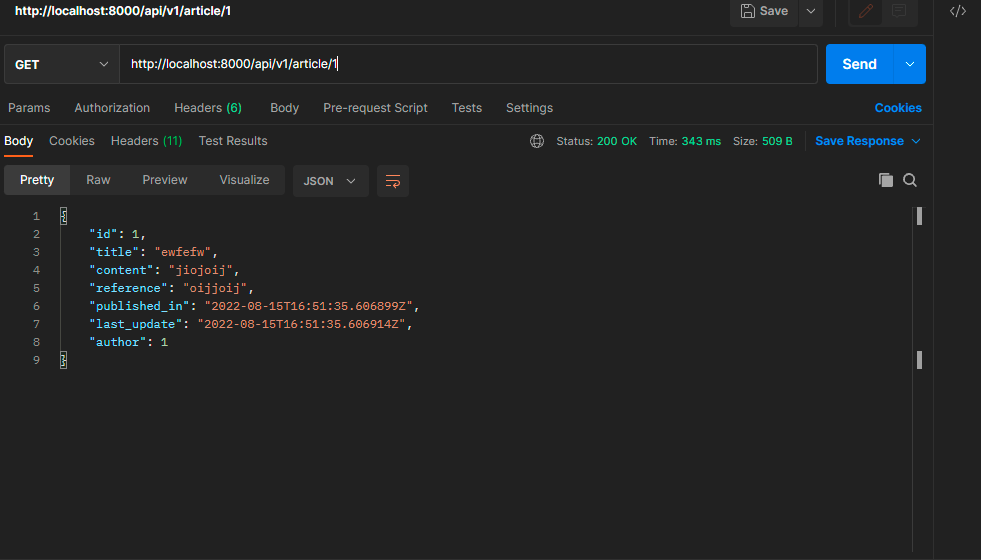
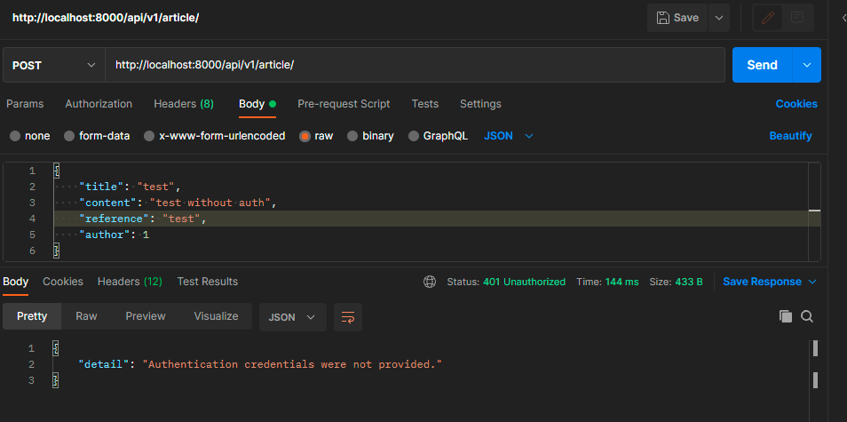
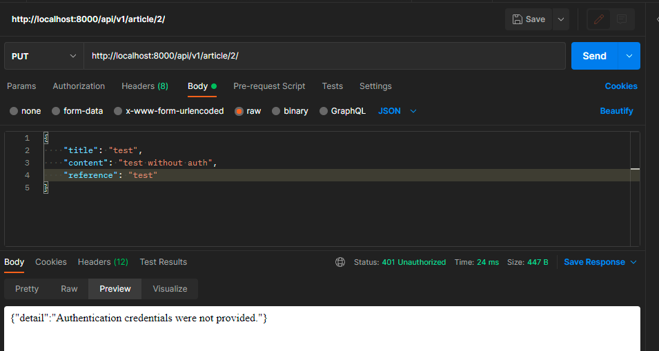
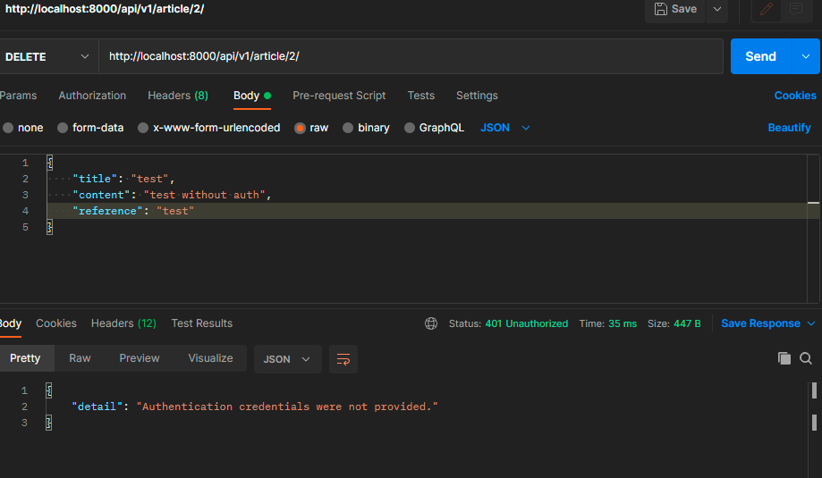
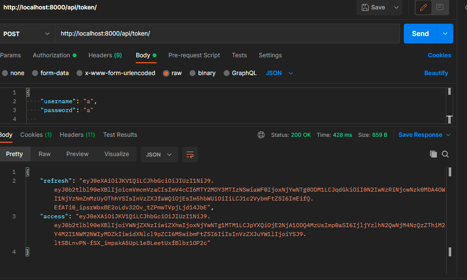
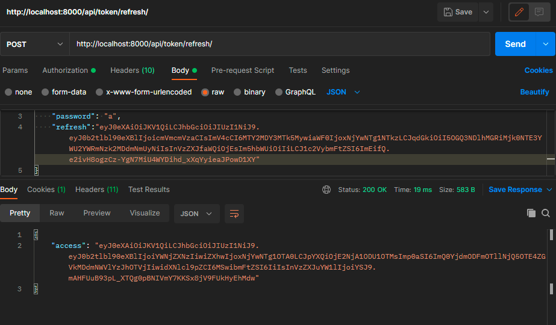
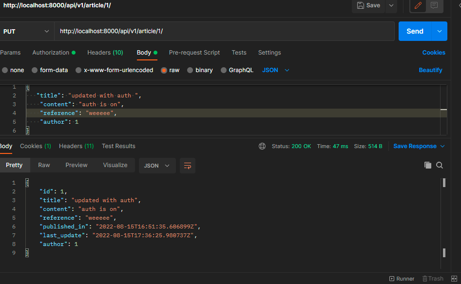
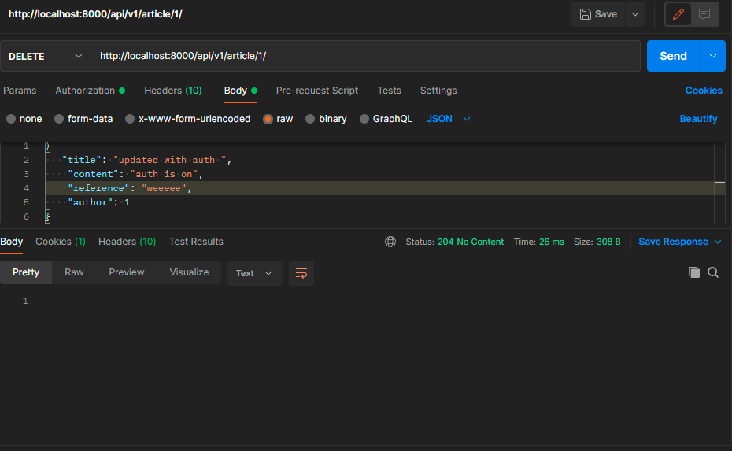

# drf-auth

> To run the app make sure that you have Docker desktop app then run the following:
>
> $ docker-compose run web python manage.py migrate
>
> then create a super user
>
> $ docker-compose run web python manage.py createsuperuser
>
> $ docker-compose up
>
>
> then you can navigate to one of the following routes:
>> /admin/
>
>> /api/v1/articles/
>
>> /api/token/
>
>> /api/token/refresh/

Testing:
> without authentication
1. get 

2. get details

3. post 

4. update

5. delete 

> token 
1. get token for user 

2. get refresh token

> With authentication

1. update

2. delete
